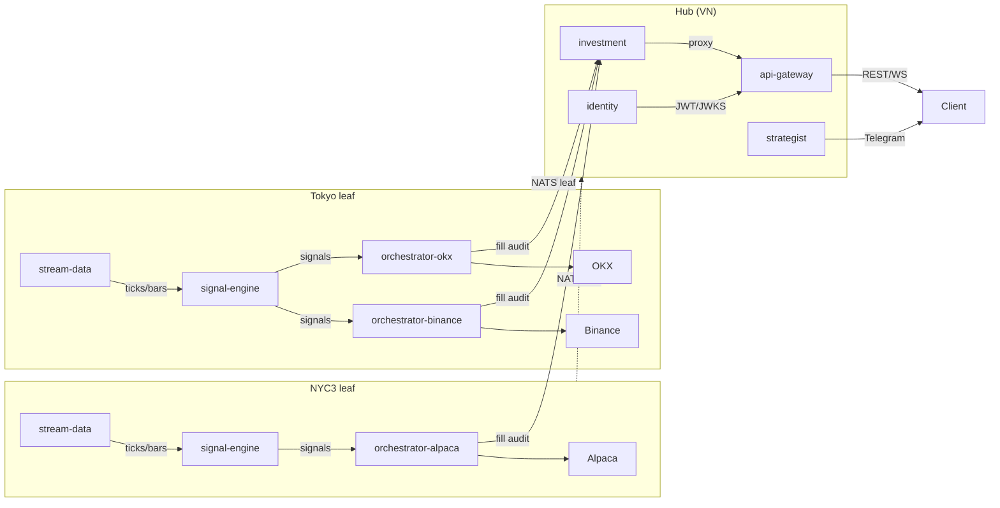

# CLAUDE.md

This file provides guidance to Claude Code (claude.ai/code) when working with code in this repository.

## Project Overview

A polyglot algorithmic trading system. Evaluates technical-analysis-based buy/sell strategies using event-driven backtesting and live signal generation.

**Stack:** Rust (backtesting/signal engine), Go (api-gateway, identity, investment, orchestrator, stream-data, hist-data, strategist), NATS (message broker), PostgreSQL + Redis, Docker Compose (orchestration).

**Workspace:** Go services share a `go.work` file at the root — all modules can reference `mallow/pkg` locally without publishing.

## Service Map



### Services

| Service | Dir | Module | Role |
| --- | --- | --- | --- |
| **api-gateway** | `api-gateway/` | `gateway` | Gin HTTP/WS gateway; JWT auth (JWKS), CORS, rate-limit (Redis), reverse proxy to all backends |
| **identity** | `identity/` | `mallow/identity` | Auth (JWT/OAuth2), user management, JWKS endpoint, Telegram bot, email notifications |
| **investment** | `investment/` | `mallow/investment` | Portfolio tracking, positions, transactions, watchlists, broker abstraction (Binance/Alpaca) |
| **orchestrator** | `orchestrator/` | `orchestrator` | Trade execution; manages bots, portfolio, risk; consumes signals; interfaces with brokers |
| **stream-data** | `stream-data/` | `stream-data` | Live tick ingestion (Binance, Alpaca, TwelveData, OKX) → bars → NATS + Parquet/CSV |
| **hist-data** | `hist-data/` | `hist-data` | Historical US stock data crawler → Parquet files; Wire DI |
| **strategist** | `thstrategist/` | `strategist` | Google ADK multi-agent AI; Telegram bot; realtime canvas; Gemini/Claude/OpenAI |
| **signal-engine** | `backtesting/crates/signal-engine/` | (Rust binary) | Consumes bars, runs strategy, publishes signals |
| **backtest-api** | `backtesting/crates/backtest-api/` | (Rust binary) | HTTP API + CLI + bench + replay tools for backtesting |
| **pkg** | `pkg/` | `mallow/pkg` | Shared Go utilities (errors, response helpers, telemetry, validation) |

## Protobuf / Message Schema

Single source of truth: `proto/market.proto`. Generated Go code in `gateway/internal/` via protoc; Rust via `prost-build` in `bt-core/build.rs`.

### Messages

| Message | Purpose |
| --- | --- |
| `TickMsg` | Raw trade event: t (Unix ms), s (symbol), class, src, p (price), v (volume), bid, ask |
| `BarMsg` | OHLCV candle: t, s, o, h, l, c, v |
| `SignalMsg` | Strategy output: t, s, dir (long/short/close), strength [0–1], optional: target_price, stop_price, pattern_kind, confidence |
| `ConfigMsg` | Engine configure: strategy name + params map |
| `ResetMsg` | Engine reset: symbol (empty = reset all) |
| `RegisterMsg` | Bot registration: bot_id, symbol, strategy, params_json, optional expiry/targets |
| `DeregisterMsg` | Bot removal: bot_id |
| `BotInfo / BotListResponse` | Bot registry queries |

### NATS Subjects

| Subject | Direction | Purpose |
| --- | --- | --- |
| `ticks.{class}.{symbol}` | publish | Raw ticks from stream-data |
| `bars.{symbol}` | publish | Aggregated OHLCV bars → signal-engine |
| `signals.{symbol}` | publish | Signals from signal-engine → orchestrator |
| `engine.configure` | publish | Set active strategy + params |
| `engine.reset` | publish | Reset engine state |
| `engine.register` / `engine.deregister` / `engine.list` | req/rep | Bot lifecycle in signal-engine |
| `user.telegram.linked` / `user.telegram.unlinked` | JetStream durable | Identity binding sync → strategist |
| `signals.query.{symbol}` / `.history` | req/rep | Signal queries from strategist |
| `bars.query.{symbol}` / `.latest` / `bars.query.symbols` | req/rep | Bar queries from strategist |

## Building and Running

### Full system (Docker)

```bash
docker compose up -d nats                   # NATS only (dev)
docker compose up -d                        # all services
docker compose --profile storage up -d      # + PostgreSQL + Redis
docker compose --profile monitoring up -d   # + Grafana + Prometheus + Surveyor
docker compose logs -f signal-engine
```

### Rust workspace — run from `backtesting/`

```bash
cargo build
cargo test
cargo test -p bt-strategy
cargo run -p signal-engine
RUST_LOG=signal_engine=debug cargo run -p signal-engine
cargo run -p backtest-api                   # HTTP API server
cargo run --bin backtest-cli                # CLI tool
```

### Go services — each has a justfile

```bash
just run        # go run ./cmd/<service>/
just dev        # air (hot reload)
just test       # go test ./...
just up         # docker compose up -d --build
just down       # docker compose down
just logs       # docker compose logs -f <service>
```

### hist-data specific

```bash
just wire       # go generate ./cmd/us-data/  (Wire DI regeneration)
just build      # go build -o main ./cmd/us-data/
```

### swagger (identity / investment / orchestrator)

```bash
just swagger          # swag init (generate docs)
just swagger-check    # validate docs are committed
```

## Architecture: Rust Backtesting Workspace

Crates in `backtesting/crates/`:

| Crate | Role |
| --- | --- |
| `bt-core` | Shared types: `Bar`, `Signal`, `Order`, `Portfolio`, `Trade`, events, traits (`Strategy`, `RiskManager`, `Component`). Compiles proto via prost-build. |
| `bt-data` | `BarFeed` trait + CSV/Parquet data loaders (polars) |
| `bt-indicator` | **39 stateful incremental indicators** — MA family (SMA/EMA/WMA/HMA/DEMA/TEMA/GMMA), Oscillators (RSI/CCI/ROC/MFI/Williams/Stochastic/TSI/ConnorsRSI), Trend (ADX/MACD/TRIX/Aroon/KAMA/KDJ), Volatility (ATR/BBands/Keltner/Donchian/SuperTrend/VolatilityRatio/Chop), Volume (OBV/CMF/VWAP), Pattern (Ichimoku/HeikenAshi/SAR/RWI/ElderRay/StochRSI/AO) |
| `bt-strategy` | **57 strategies** + `factory::build_strategy(name, params)` + `DynamicStrategy` (declarative JSON) + `CelStrategy` (expression-based entry/exit) — all implement `Strategy` trait with `reset()` |
| `bt-engine` | Event-driven engine (`Engine<S,R,B>`); `SyncBus` (VecDeque, max throughput) and `TokioBus` (tokio::mpsc, live-extensible) |
| `bt-report` | `BacktestReport`: Sharpe ratio, Sortino, Calmar, max drawdown, win rate, profit factor, P&L |
| `bt-chart` | Static (PNG/SVG) and interactive (HTML/ECharts) chart generation; optional bt-pattern bridge |
| `bt-pattern` | Technical pattern detection (bull flag, ascending triangle, etc.) |
| `bt-vectorized` | Polars-based vectorized backtesting for batch optimization (rayon parallel) |
| `signal-engine` | **Binary**: subscribes `bars.*`, runs configured strategy, publishes `SignalMsg` to `signals.{symbol}` |
| `backtest-api` | **Binaries**: HTTP API server, `backtest-cli` CLI tool, `bench` benchmarker, `replay` data replayer |

**Engine event flow:** `MarketEvent → Strategy → SignalEvent → RiskManager → OrderEvent → SimBroker → FillEvent`

**backtest-cli flags:** `--strategy`, `--params`, `--capital`, `--from`, `--to`, `--commission`, `--slippage`, `--market-hours`, `--exchange`, `--walk-forward`

Strategies and indicators implement `reset()` for reuse across optimization runs. See `backtesting/docs/README.md` for full indicator/strategy catalog.

## Architecture: Go Services

### api-gateway

```text
internal/
├── config/         # Viper config (JWT, NATS, Redis, upstream URLs)
├── handler/        # health, strategies, backtest, chat, proxy handlers
├── middleware/      # CORS, JWT (JWKS validation), rate-limit (Redis token bucket)
├── service/        # StrategistClient (HTTP proxy)
└── ws/             # WebSocket support
```

- JWT validated against identity service JWKS endpoint
- Rate limiting via Redis
- Reverse proxies: `/api/identity/*`, `/api/investment/*`, `/api/orchestrator/*`, `/api/strategist/*`

### identity

```text
internal/
├── app/            # Uber FX wiring
├── config/         # Viper config
├── infra/          # GORM (Postgres/SQLite), NATS, Redis, Swagger gen
├── middleware/      # CORS, logging, JWT, rate-limit, Telegram auth
├── module/
│   ├── auth/       # OAuth2, JWT generation, password hashing
│   ├── notification/ # Email + Telegram notifications
│   ├── profile/    # User profile
│   └── user/       # User CRUD
├── router/         # Gin routes
├── server/         # HTTP server
└── telegram/       # Telegram bot
```

- Publishes `user.telegram.linked` / `user.telegram.unlinked` to NATS JetStream
- Exposes `/.well-known/jwks.json` for gateway JWT validation
- Swagger docs via swaggo/swag

### investment

```text
internal/
├── app/            # Uber FX wiring
├── config/         # Viper config
├── infra/          # GORM + Postgres, NATS, Binance/Alpaca SDKs, OpenTelemetry
├── module/
│   ├── account/    # Account management
│   ├── broker/     # Broker account config
│   ├── cash_flow/  # Cash flow tracking
│   ├── portfolio/  # Portfolio aggregation
│   ├── position/   # Open positions
│   ├── price_feed/ # Real-time prices
│   ├── snapshot/   # Portfolio snapshots
│   ├── transaction/ # Trade/dividend recording
│   └── watchlist/  # User watchlists
└── shared/         # Validator, models, telemetry
```

- Full OpenTelemetry tracing (gin middleware, context propagation)
- Swagger docs via swaggo/swag

### orchestrator

```text
internal/
├── app/            # Uber FX wiring
├── config/         # Config
├── core/           # Domain types + interfaces
├── infra/
│   ├── engine/     # Event-driven backtest engine
│   ├── exchange/   # Broker adapters: alpaca, binance, bybit, ibkr, oanda, okx
│   ├── marketdata/ # Market data
│   ├── nats/       # NATS pub/sub
│   ├── natsapi/    # NATS req/rep
│   └── postgres/   # PostgreSQL persistence
├── module/         # risk, portfolio, etc.
├── runtime/        # Execution context
└── shared/         # Utilities
```

### stream-data

```text
internal/
├── app/            # App init + config (config.yaml)
├── infra/          # NATS publisher, Parquet writer
├── model/          # BarMsg, TickMsg
├── provider/       # alpaca, binance, okx, twelvedata WebSocket/REST adapters
├── saver/          # Parquet + CSV persistence
└── stream/         # Bar aggregation, filtering
```

- Configured via `config.yaml`; secrets always in env vars only
- Known bug: TwelveData `day_volume` is cumulative, breaks BarAggregator volume

### hist-data

```text
internal/
├── app/            # App init + Wire DI
├── crawl/          # 9 sub-packages for different providers/strategies
├── model/          # Domain models
├── provider/       # Data source adapters
└── saver/          # Parquet persistence
```

- Wire dependency injection pattern; regenerate with `just wire`

### strategist (`thstrategist/`)

The AI strategist service. Uses **Uber FX** for dependency injection and **Google ADK** for multi-agent orchestration.

```text
thstrategist/internal/
├── app/                     # FX wiring, lifecycle, NATS identity sync
│   ├── fx.go                # Uber FX Module with all providers
│   ├── app.go               # HTTP server + route registration
│   ├── identity_binding_sync.go  # JetStream consumer for linked/unlinked events
│   └── telegram_manager.go  # Telegram bot lifecycle wrapper
├── config/                  # Viper config
├── module/
│   ├── domain/              # Pure types (no internal imports): domain.go, finance.go, market.go
│   ├── service/             # ChatService, AgentGateway, RealtimeService
│   ├── repo/                # ConversationRepo — postgres/ and noop/ impls
│   ├── handler/             # Gin handlers: chat.go, telegram.go, realtime.go
│   └── dto/                 # chat.go, telegram.go, realtime.go
├── infra/
│   ├── agent/               # ADK agent: root + analyst + commander sub-agents, write_artifact tool
│   ├── agentruntime/        # ADKGateway (Reply, ResetSession, toMessageParts)
│   ├── llm/                 # LLM abstraction (gemini | claude | openai)
│   ├── orchestrator/        # OrchestratorClient — NATS req/rep + mock
│   ├── signal/              # SignalClient interface (NATS req/rep)
│   ├── marketdata/          # MarketDataClient interface (NATS req/rep)
│   ├── simulation/          # BacktestClient — nats | http | grpc | mock transport
│   └── mock/                # Static mock data for dev mode
└── telegram/                # Bot, handlers, format, renderer, identity_bindings
```

**Agent architecture:** root agent routes to analyst (list/run/analyze backtest) or commander (bot/portfolio/orders management). `write_artifact` tool pushes markdown to the in-memory realtime canvas (WebSocket at `/realtime/ws`).

**Session design:** Telegram session ID = `tg_{chatID}` (stable). Reset = ADK session delete+recreate via `ResetSession`. ADK sessions are in-memory only (`session.InMemoryService()`).

**Database schema (optional PostgreSQL):**

```sql
users(chat_id PK, created_at)
conversations(session_id PK, chat_id FK, source TEXT, is_current BOOL, started_at, last_active)
  -- UNIQUE INDEX (chat_id, source) WHERE is_current = true
messages(id, session_id FK, role, content, payload JSONB, created_at)
```

Schema migration is inline (`repo/postgres/migrate.go`) using `ADD COLUMN IF NOT EXISTS` DDL — no migration tool needed in dev.

## Environment Variables

### System-wide (set in `.env` or Docker Compose)

```env
NATS_URL                    # default: nats://localhost:4222
JWT_SECRET
POSTGRES_PASSWORD           # only with --profile storage
REDIS_URL                   # default: redis://localhost:6379
RUST_LOG                    # e.g. signal_engine=debug
```

### api-gateway env

```env
PORT                        # default: 8080
NATS_URL
REDIS_URL
JWT_SECRET
IDENTITY_URL                # http://identity:8082
INVESTMENT_URL              # http://investment:8083
ORCHESTRATOR_URL            # http://orchestrator:9090
STRATEGIST_URL              # http://strategist:8081
```

### identity env

```env
PORT                        # default: 8082
DATABASE_URL                # postgres://...
REDIS_URL
NATS_URL
JWT_SECRET
TELEGRAM_BOT_TOKEN
```

### investment / orchestrator env

```env
PORT
DATABASE_URL
NATS_URL
ALPACA_API_KEY / ALPACA_API_SECRET
BINANCE_API_KEY / BINANCE_API_SECRET
```

### stream-data env

```env
NATS_URL
BINANCE_SYMBOLS             # comma-separated
ALPACA_API_KEY / ALPACA_API_SECRET
TWELVEDATA_API_KEY
OKX_API_KEY / OKX_API_SECRET / OKX_PASSPHRASE
```

### strategist env

```env
PORT                        # default: 8080
NATS_URL
LLM_PROVIDER                # gemini (default) | claude | openai
LLM_MODEL                   # override (default: gemini-2.5-flash / claude-sonnet-4-5 / gpt-4o)
GOOGLE_API_KEY
ANTHROPIC_API_KEY
OPENAI_API_KEY
DATABASE_URL                # postgres://... (empty = no persistence)
PERSIST_CONVERSATIONS       # true (default) | false
TELEGRAM_BOT_TOKEN
TELEGRAM_ALLOWED_CHATS      # comma-separated chat IDs (empty = allow all)
BACKTEST_TRANSPORT          # nats (default) | http | grpc | mock
BACKTEST_NATS_URL           # fallback: NATS_URL
BACKTEST_HTTP_URL
BACKTEST_HTTP_PATH          # default: /api/backtest
BACKTEST_GRPC_ADDR
BACKTEST_TIMEOUT_SEC        # default: 30
MOCK                        # true = static data, no external calls
DISABLE_EXTERNAL_SERVICES   # true = MOCK + no Telegram + no DB
LOG_LEVEL                   # debug | info (default) | warn | error
ORCHESTRATOR_URL            # http://orchestrator:9090 (fallback when NATS unavailable)
```

## Key Conventions

- NATS subjects: `{class}.{symbol}` for data (e.g., `bars.BTCUSDT`), `{service}.{action}` for control
- Protobuf (binary, schema-first) for all pub/sub NATS messages; JSON for req/rep envelopes
- NATS req/rep envelopes: `{ok: bool, data: any, error: string}` shape
- `bt-core` is the Rust lingua franca — all backtesting crates + signal-engine share it
- Go workspace (`go.work`) at root: all modules can import `mallow/pkg` locally
- Each Go service has its own `go.mod` (independent deployable modules)
- Secrets always in env vars, never in config files or committed `.env` files
- `stream-data` configured via `config.yaml`; all other services via env vars only
- In strategist: `module/domain` has zero internal imports — everything else may depend on it
- `shared/` in each Go service delegates to `mallow/pkg/shared` (error codes, response helpers)
- Observability: OpenTelemetry tracing integrated in identity, investment, orchestrator, strategist
