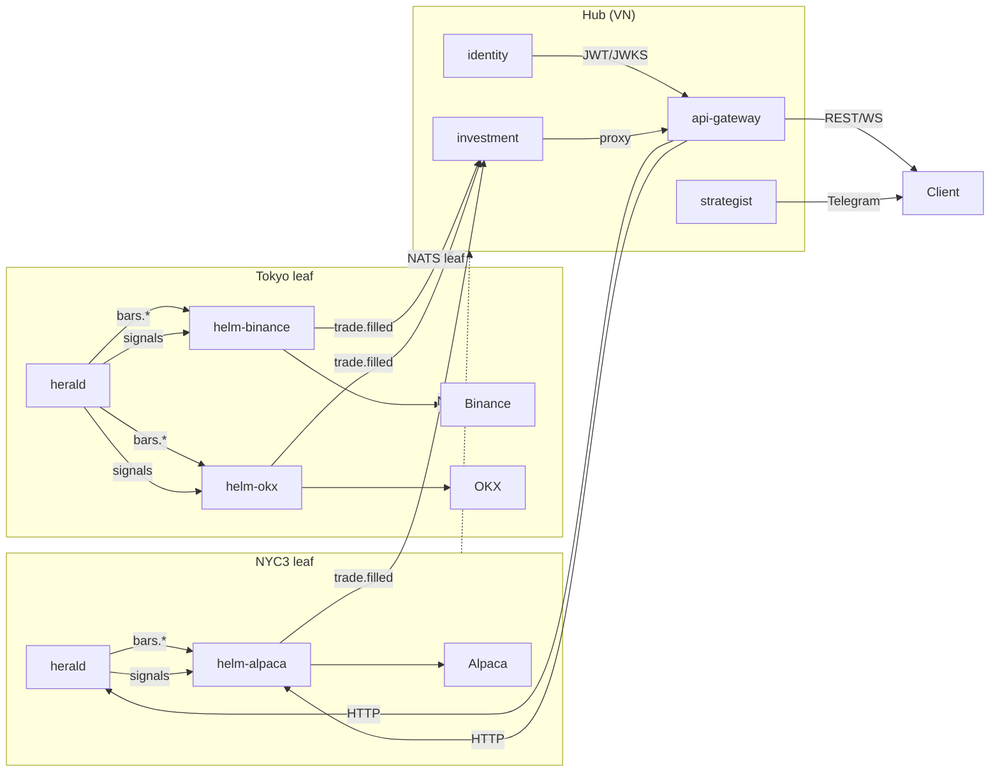

# CLAUDE.md

This file provides guidance to Claude Code (claude.ai/code) when working with code in this repository.

## Project Overview

A polyglot algorithmic trading system. Evaluates technical-analysis-based buy/sell strategies using event-driven backtesting and live signal generation.

**Stack:** Rust (backtesting/signal engine — `almanac` workspace), Go (api-gateway, identity, investment, helm, hist-data, strategist), NATS (message broker), PostgreSQL + Redis, Docker Compose (orchestration).

**Workspace:** Go services share a `go.work` file at the root — all modules can reference `mallow/pkg` locally without publishing.

```
go.work uses: api-gateway, hist-data, identity, investment, helm, pkg
```

## Service Map



### Services

| Service | Dir | Module | Role |
| --- | --- | --- | --- |
| **api-gateway** | `api-gateway/` | `gateway` | Gin HTTP/WS gateway; JWT auth (JWKS), CORS, rate-limit (Redis), reverse proxy to all backends |
| **identity** | `identity/` | `mallow/identity` | Auth (JWT/OAuth2), user management, JWKS endpoint, Telegram bot, email notifications, internal blacklist check |
| **investment** | `investment/` | `mallow/investment` | Portfolio tracking, positions, transactions, watchlists, broker abstraction (Binance/Alpaca) |
| **helm** | `helm/` | `mallow/helm` | Trade execution: Helm (account container) + Hand (autonomous bot); signal routing, poslog, portfolio, exchange adapters |
| **hist-data** | `hist-data/` | `hist-data` | Historical data crawler (US stocks + crypto) → Parquet files; Wire DI |
| **strategist** | `thstrategist/` | `strategist` | Google ADK multi-agent AI; Telegram bot; realtime canvas; Gemini/Claude/OpenAI |
| **herald** | `almanac/crates/herald/` | (Rust binary `alm-herald`) | WebSocket ingestion (Binance, OKX) → Ledger + Registry → NATS; HTTP API for live data + backtests |
| **pkg** | `pkg/` | `mallow/pkg` | Shared Go utilities (errors, response helpers, telemetry, validation) |

> **Note:** `orchestrator/` (old Go service) has been fully replaced by `helm/`. `stream-data` (Go) has also been removed — herald ingests WebSocket feeds directly.

## Protobuf / Message Schema

Single source of truth: `proto/market.proto`. Generated Go code in `helm/internal/infra/engine/`; Rust via `prost-build` in `alm-core/build.rs`.

### Messages

| Message | Purpose |
| --- | --- |
| `TickMsg` | Raw trade event: t (Unix ms), s (symbol), class, src, p (price), v (volume), bid, ask |
| `BarMsg` | OHLCV candle: t, s, o, h, l, c, v |
| `SignalMsg` | Strategy output: t, s, dir (long/short/close), strength [0–1], optional: price, target_price, stop_price, pattern_kind, confidence |
| `SignalResponse` | Herald→helm envelope: repeated SignalMsg + orch_id (helm_id) + bot_id (hand_id) |
| `RegisterMsg` | Hand registration: bot_id, symbol, strategy, params_json, orch_id, optional expiry/targets/timeframe |
| `DeregisterMsg` | Hand removal: bot_id (empty = remove all) |

### NATS Subjects

| Subject | Direction | Purpose |
| --- | --- | --- |
| `bars.{symbol}` | publish | OHLCV bars from herald → helm (BarAggregator → tick router) |
| `signals` | publish | SignalResponse from herald → helm (orch_id + bot_id in protobuf payload) |
| `engine.register` / `engine.deregister` / `engine.list` | req/rep | Hand registration in herald registry |
| `helm.helms.*` | req/rep | Helm CRUD + control: `list` `get` `update` `enable` `disable` `pause` `resume` `kill` `halt.reset` `portfolio` `positions` `trades` `orders` |
| `helm.hands.*` | req/rep | Hand CRUD + control: `list` `get` `create` `update` `delete` `start` `stop` `restart` `pause` `resume` `kill` |
| `helm.accounts.linked` | publish | Broker account linked → helm auto-creates disabled Helm |
| `helm.accounts.unlinked` | publish | Broker account unlinked → helm auto-deletes Helm |
| `trade.filled.{helm_id}` | publish | Fill audit from helm → investment |
| `portfolio.synced.{account_id}` | publish | Portfolio sync notification after equity update |
| `investment.transactions.{account_id}` | JetStream | Transaction events (helm → investment) |
| `user.telegram.linked` / `user.telegram.unlinked` | JetStream durable | Identity binding sync → strategist |
| `signals.query.{symbol}` / `.history` / `.active` | req/rep | Signal queries from strategist |
| `bars.query.{symbol}` / `.latest` / `bars.query.symbols` | req/rep | Bar queries from strategist |

## Building and Running

### Full system (Docker)

```bash
docker compose up -d nats                   # NATS only (dev)
docker compose up -d                        # all services
docker compose --profile storage up -d      # + PostgreSQL + Redis
docker compose --profile monitoring up -d   # + Grafana + Prometheus + Surveyor
docker compose logs -f herald
docker compose logs -f helm
```

### Rust workspace — run from `almanac/`

```bash
cargo build
cargo test
cargo test -p alm-strategy
cargo run -p alm-herald                         # live signal engine + HTTP API
RUST_LOG=herald=debug cargo run -p alm-herald   # with debug logging
cargo watch -x 'run -p alm-herald'              # hot-reload (requires cargo-watch)
cargo run -p alm-engine                         # backtest example (main.rs)
cargo run --bin benchmark                       # quick backtest CLI
cargo run --bin compare                         # bar-by-bar strategy comparison
cargo run --bin tournament                      # strategy tournament on synthetic data
```

Herald HTTP API listens at `0.0.0.0:8090` (configurable via `HERALD_HTTP_ADDR`).

### Go services — each has a justfile

```bash
just run        # go run ./cmd/<service>/
just dev        # air (hot reload)
just test       # go test ./...
just up         # docker compose up -d --build
just down       # docker compose down
just logs       # docker compose logs -f <service>
```

### hist-data specific

```bash
just wire       # go generate ./cmd/us-data/  (Wire DI regeneration)
just build      # go build -o main ./cmd/us-data/
```

### alm-py (Python bindings)

```bash
cd almanac/crates/alm-py
maturin develop          # editable install into current venv
maturin build --release  # build wheel
```

### swagger (identity / investment / helm)

```bash
just swagger          # swag init (generate docs)
just swagger-check    # validate docs are committed
```

## Architecture: Rust Almanac Workspace

Crates in `almanac/crates/`:

| Crate | Package | Role |
| --- | --- | --- |
| `core` | `alm-core` | Shared types: `Bar`, `Tick`, `Signal`, `Order`, `Portfolio`, `Trade`, `Timeframe`, events, traits (`Strategy`, `RiskManager`, `Component`), `RegimeState`, `ExitRules`. Compiles proto via prost-build. |
| `data` | `alm-data` | `BarFeed` trait + CSV/Parquet data loaders (Arrow/Parquet), `BarAggregator`, `RowGroupFeed` |
| `indicator` | `alm-indicator` | **~66 stateful incremental indicators** — Trend/MA (SMA/EMA/WMA/HMA/DEMA/TEMA/SMMA/ALMA/LSMA/KAMA/KDJ/McGinley/KalmanFilter/VWMA/Aroon/ADX/DMI/MACD/TRIX/Vortex), Momentum (RSI/CCI/ROC/MFI/Williams/Stochastic/TSI/ConnorsRsi/CMO/PPO/PMO/KST/DPO/Coppock/AO/BOP/BullBearPower/UO/SMI/RVI/Fisher/RCI), Volume (OBV/CMF/VWAP), Channel (BBands/Keltner/Donchian), Pattern (Ichimoku/ElderRay/RWI/StochRSI/WilliamsFractal), Viewing (Alligator/GMMA/HeikenAshi), Regime (Chop/ChopZone/VolatilityRatio), Risk (ATR/SuperTrend/ParabolicSar/ChandelierExit/ChandeKrollStop) |
| `ledger` | `alm-ledger` | Live market-state container: `Ledger` (DashMap of per-symbol indicator state), `IndicatorHandle` (refcounted), warm-set bootstrapping from Parquet on startup |
| `strategy` | `alm-strategy` | **~80 named strategies** + `factory::build_strategy(name, params)` + `RhaiStrategy` (Rhai script) + `bar_resampler` (MTF) + `catalog` — all implement `Strategy` trait with `reset()` |
| `engine` | `alm-engine` | Event-driven engine (`Engine<S,R,B>`); `SyncBus` (VecDeque, zero atomic overhead); `MultiEngine` (multi-symbol time-merge); `WalkForward` (rolling/anchored); `backtest::run()` library function; binaries: `alm-engine` (example), `benchmark`, `compare`, `tournament`, `try_strategy` |
| `report` | `alm-report` | `BacktestReport`: Sharpe ratio, Sortino, Calmar, max drawdown, win rate, profit factor, P&L; `BuyHoldBenchmark`; `monte_carlo`; `portfolio_analytics` |
| `pattern` | `alm-pattern` | Technical pattern detection (bull flag, ascending triangle, etc.) |
| `herald` | `alm-herald` | **Binary**: WebSocket ingestion (Binance, OKX) → `Ledger` → `Registry` → NATS signals; 24h `BarRing` buffer; HTTP API (Axum, port 8090); optional PostgreSQL store |
| `alm-py` | `alm_py` | PyO3 Python bindings: `run_backtest`, `kalman`, `monte_carlo`, `list_strategies` |
| `alm-wasm` | `alm_wasm` | WASM bindings for browser-side backtesting |

**Engine event flow:** `MarketEvent → Strategy → SignalEvent → RiskManager → OrderEvent → SimBroker → FillEvent`

**Herald architecture:**
```text
feed::binance  ─┐
feed::okx      ─┤  mpsc → Handler::run
                ▼
         Ledger::advance ──→ NATS publish bars.{symbol}
                │                   │
          LedgerObserver(s)    bar_bcast (broadcast) ──→ SSE GET|POST /api/v1/stream/:symbol
                │
          Registry (evaluate bots)
                │
         signal_publisher ──→ NATS "signals"
                │
           sig_bcast (broadcast) ──→ SSE GET /api/v1/stream/signals
```

Herald HTTP API routes (all under `/api/v1/`):

| Group | Routes |
|-------|--------|
| **Live** | `GET /api/v1/symbols` · `GET /api/v1/indicators` · `GET /api/v1/data/:symbol` (latest bar) · `POST /api/v1/data/:symbol` (OHLCV + indicator snapshot; DuckDB parquet fallback for historical pages) · `POST /api/v1/data/duckdb` |
| **Backtest** | `GET /api/v1/strategies` · `POST /api/v1/backtest` · `POST /api/v1/backtest/estimate` · `POST /api/v1/backtest/rhai` (always saves strategy + case + result) |
| **Rhai** | `POST /api/v1/rhai/validate` (lint script for Monaco editor; **not proxied through api-gateway**) |
| **Store** | `GET\|POST /api/v1/store/strategies` · `GET\|PUT\|DELETE /api/v1/store/strategies/:id` · `GET /api/v1/store/strategies/:name/versions` · `GET\|POST /api/v1/store/cases` · `GET\|PUT\|DELETE /api/v1/store/cases/:id` · `POST /api/v1/store/cases/:id/run` · `POST /api/v1/store/cases/:id/signals` · `GET /api/v1/store/cases/:id/results` · `GET\|DELETE /api/v1/store/results/:id` |
| **Watch** | `GET\|POST /api/v1/watch` · `GET\|PUT\|DELETE /api/v1/watch/:id` (admin warm-set management) |
| **Stream** | `GET /api/v1/stream/:symbol?tf=M1` (EventSource-compatible, raw OHLCV) · `POST /api/v1/stream/:symbol` (indicators or Rhai script) · `GET /api/v1/stream/signals` (SSE signal batches) |
| **Health** | `GET /health` |

> **SSE modes:** `GET /stream/:symbol` is native-`EventSource`-compatible — raw bars, no indicator config. `POST /stream/:symbol` carries a `StreamRequest` body (indicator configs or Rhai script) and requires `fetch()` + `ReadableStream`. Both modes emit a `status` event first, then `bar` events per incoming candle.

**Strategy versioning (store):** Each strategy version is immutable. `previous_id` parent-pointer links versions like a git commit chain. `POST /backtest/rhai` always creates a new version via `upsert_strategy`: if `strategy_id` is provided it compares scripts (same → reuse, different → new version with `previous_id = strategy_id`); otherwise deduplicates by `spec_hash` globally.

**DuckDB parquet fallback (`POST /api/v1/data/:symbol`):** When `candles.before` predates the live ledger window, falls back to DuckDB row-group scan over Parquet files. OKX symbols normalized (`BTC-USDT` → `BTCUSDT`) before lookup.

## Architecture: Go Services

### api-gateway

```text
internal/
├── config/         # Viper config (JWT, NATS, Redis, upstream URLs)
├── handler/        # health, proxy handlers, chat SSE
├── middleware/      # CORS, JWT (JWKS validation), rate-limit (Redis token bucket)
└── service/        # StrategistClient (HTTP proxy), IdentityClient (blacklist check)
```

- JWT validated against identity service JWKS endpoint (`JWT_JWKS_URL`)
- `IdentityClient`: fallback blacklist check via `GET /api/v1/internal/blacklist/check` when Redis is cold
- **Route table:**

| Gateway path | Upstream | Notes |
|---|---|---|
| `Any /api/v1/auth/*` | identity | no JWT required |
| `Any /api/v1/investment/*` | investment | JWT required |
| `Any /api/v1/helm/*path` | helm | JWT required; `/api/v1/helm/` → `/api/` path rewrite |
| `Any /api/v1/strategist/*` | strategist | JWT required; path rewrite |
| `GET /api/v1/symbols` | herald | JWT required |
| `GET /api/v1/indicators` | herald | JWT required |
| `GET\|POST /api/v1/data/:symbol` | herald | JWT required |
| `GET /api/v1/strategies` | herald | JWT required |
| `POST /api/v1/backtest` | herald | JWT required |
| `POST /api/v1/backtest/estimate` | herald | JWT required |
| `POST /api/v1/backtest/rhai` | herald | JWT required |
| `GET\|POST /api/v1/stream/:symbol` | herald | JWT required; SSE streamed via reverse proxy |
| `GET /api/v1/stream/signals` | herald | JWT required; SSE |
| `Any /api/v1/store/*` | herald | JWT required |
| `Any /api/v1/watch` / `Any /api/v1/watch/:id` | herald | JWT required |
| `POST /api/v1/chat` / `POST /api/v1/chat/stream` | strategist (internal) | JWT required |

- `POST /api/v1/rhai/validate` is **not** in the gateway route table — call herald directly on port 8090

### helm

The trade execution service. Replaced the old `orchestrator/` service.

```text
helm/
├── cmd/helm/         # main entry point + swagger annotations
├── internal/
│   ├── app/          # Uber FX wiring, lifecycle, exchange factory, server
│   ├── config/       # Viper config (API_ADDR, POSTGRES_URL, NATS_URL, BAR_INTERVAL, …)
│   ├── infra/
│   │   ├── engine/   # SignalClient (NATS protobuf → bars + signals), BarAggregator
│   │   ├── exchange/ # Broker adapters: alpaca, binance, bybit, oanda, okx
│   │   ├── marketdata/ # Market data listeners (alpaca, okx WebSocket)
│   │   ├── nats/     # NATS + JetStream setup
│   │   ├── natsapi/  # NATS req/rep protocol (subjects, CallerMeta, envelopes)
│   │   ├── poslog/   # Position event log: JetStream-backed, crash-resilient
│   │   └── postgres/ # PostgreSQL persistence
│   ├── module/
│   │   ├── hand/     # Hand CRUD + lifecycle + NATS handler
│   │   └── helm/     # Helm CRUD + account linking + NATS handler
│   └── runtime/      # HelmRuntime, Hand goroutine, Registry, SignalDispatcher, reconciler
```

**Core concepts:**
- **Helm**: account-level container. One Helm per broker account. Owns exchange creds, capital budget, portfolio, risk circuit-breakers. Created automatically when `helm.accounts.linked` fires.
- **Hand** (`runtime.Hand`): autonomous signal-following bot. Owns a Rhai strategy, position sizing config, exit rules, and a JetStream poslog. Multiple hands per helm.
- **HelmRuntime**: in-memory execution context shared by all hands under one helm (exchange, portfolio, order book, poslog).
- **poslog**: JetStream-backed write-ahead log of position events (`order_placed`, `order_filled`, `order_cancelled`, `position_orphaned`). Replayed on restart by the reconciler to restore in-memory state.
- **SignalDispatcher**: routes incoming `SignalResponse` from herald to the correct Hand channel by `bot_id`.
- **Registry** (`runtime.Registry`): in-memory map of `helmID → HelmRuntime`. `SpawnAll` on startup; `Get` for dispatch.

**Hand lifecycle states:** `stopped → running → paused → stopped` (via start/stop/pause/resume). Also: `kill` (stop + flatten all this hand's positions at exchange) and `release` (stop + emit `position_orphaned` poslog events, leaving positions live at exchange).

**Helm lifecycle states:** `active` / `paused` (cascade-stops all hands) / `halted` (after kill; reset with `/halt/reset`) / `disabled` (admin soft-lock).

**HTTP API** (Gin, port `API_ADDR` default `localhost:8084`; proxied at `/api/v1/helm/` by gateway):
- `GET|PUT /api/v1/helms/:id` · `GET /api/v1/helms`
- `POST /api/v1/helms/:id/enable|disable|pause|resume|kill` · `POST /api/v1/helms/:id/halt/reset`
- `GET /api/v1/helms/:id/portfolio|positions|trades|orders`
- `GET /api/v1/helms/:id/exchange/account|price` · `POST|GET|DELETE /api/v1/helms/:id/exchange/orders`
- `POST /api/v1/hands` · `GET /api/v1/hands` · `GET|PUT|DELETE /api/v1/hands/:id`
- `POST /api/v1/hands/:id/start|stop|restart|pause|resume|kill|release`
- `GET /metrics` (Prometheus) · `GET /health` · `GET /swagger/*`

**NATS API**: same operations as HTTP, subjects under `helm.helms.*` and `helm.hands.*`. CallerMeta (`caller_user_id`, `caller_svc`) embedded in all user-scoped request payloads. Gateway and strategist populate these from the validated JWT before publishing.

**Startup sequence (Uber FX lifecycle):**
1. `hydrateRuntimes` — load all helm configs from DB, spawn `HelmRuntime` for each
2. `hydrateHands` — load all persisted hands, wire into service (depends on runtimes being ready)
3. `subscribeSignals` — subscribe NATS `signals` subject via SignalDispatcher
4. `startNATSAPI` — subscribe all `helm.*` NATS subjects
5. `runOrchestrator` — start HTTP server + market data listener + bar builder + tick router

### identity

```text
internal/
├── app/            # Uber FX wiring
├── config/         # Viper config
├── infra/          # GORM (Postgres/SQLite), NATS, Redis, Swagger gen
├── middleware/      # CORS, logging, JWT, rate-limit, Telegram auth, ServiceAuth
├── module/
│   ├── auth/       # OAuth2, JWT generation, password hashing; InternalHandler
│   ├── notification/ # Email + Telegram notifications
│   ├── profile/    # User profile
│   └── user/       # User CRUD
├── router/         # Gin routes
├── server/         # HTTP server
└── telegram/       # Telegram bot
```

- Publishes `user.telegram.linked` / `user.telegram.unlinked` to NATS JetStream
- Exposes `/.well-known/jwks.json` for gateway JWT validation
- `InternalHandler`: service-to-service endpoint protected by `X-Service-Secret`
- Swagger docs via swaggo/swag

### investment

```text
internal/
├── app/            # Uber FX wiring
├── config/         # Viper config
├── infra/          # GORM + Postgres, NATS, Binance/Alpaca SDKs, OpenTelemetry
├── module/
│   ├── account/    # Account management
│   ├── broker/     # Broker account config
│   ├── cash_flow/  # Cash flow tracking
│   ├── derivative/ # Derivative positions
│   ├── portfolio/  # Portfolio aggregation
│   ├── position/   # Open positions
│   ├── snapshot/   # Portfolio snapshots
│   ├── transaction/ # Trade/dividend recording
│   └── watchlist/  # User watchlists
└── shared/         # Validator, models, telemetry
```

- Full OpenTelemetry tracing (gin middleware, context propagation)
- Swagger docs via swaggo/swag

### hist-data

```text
internal/
├── app/            # App init + Wire DI
├── crawl/          # Core interfaces: job, producer, runner, progress, report
├── model/          # Domain models
├── provider/       # Data source adapters:
│   ├── binance/    # Binance REST API (requires API key)
│   ├── binanceflat/ # Binance Vision CDN flat-files (no API key, ZIP/CSV klines)
│   ├── okx/        # OKX REST API
│   ├── polygon/    # Polygon.io (US stocks)
│   ├── twelvedata/ # TwelveData (US stocks)
│   └── vci/        # VCI (Vietnam)
└── saver/          # Parquet persistence
```

- Wire dependency injection; regenerate with `just wire`
- Symbols config shared with herald via `deployment/symbols.yaml`
- `binanceflat`: downloads ZIP archives from `data.binance.vision` CDN — no API key

### strategist (`thstrategist/`)

```text
thstrategist/internal/
├── app/                     # FX wiring, lifecycle, NATS identity sync
├── config/                  # Viper config
├── module/
│   ├── domain/              # Pure types (no internal imports)
│   ├── service/             # ChatService, AgentGateway, RealtimeService
│   ├── repo/                # ConversationRepo — postgres/ and noop/ impls
│   ├── handler/             # Gin handlers: chat.go, telegram.go, realtime.go
│   └── dto/
├── infra/
│   ├── agent/               # ADK agent: root + analyst + commander sub-agents
│   ├── agentruntime/        # ADKGateway (Reply, ResetSession, toMessageParts)
│   ├── llm/                 # LLM abstraction (gemini | claude | openai)
│   ├── orchestrator/        # HelmClient — NATS req/rep to helm service (subjects: helm.helms.*, helm.hands.*)
│   ├── signal/              # SignalClient interface (NATS req/rep)
│   ├── marketdata/          # MarketDataClient interface (NATS req/rep)
│   ├── simulation/          # BacktestClient — nats | http | grpc | mock transport
│   └── mock/                # Static mock data for dev mode
└── telegram/                # Bot, handlers, format, renderer, identity_bindings
```

- `infra/orchestrator/` is the helm client — NATS subjects match `helm/internal/infra/natsapi`
- Agent architecture: root → analyst (backtests) or commander (helm/hand/portfolio management)
- `write_artifact` tool pushes markdown to realtime canvas (WebSocket at `/realtime/ws`)
- Telegram session ID = `tg_{chatID}`; ADK sessions are in-memory only

## Environment Variables

### System-wide

```env
NATS_URL                    # default: nats://localhost:4222
JWT_SECRET
POSTGRES_PASSWORD           # only with --profile storage
REDIS_URL                   # default: redis://localhost:6379
RUST_LOG                    # e.g. herald=info,alm_ledger=info
```

### herald env

```env
HERALD_HTTP_ADDR            # default: 0.0.0.0:8090
HERALD_TF                   # timeframe: M1 (default), M5, M15, M30, H1, H4, D1, W1
HERALD_SYMBOLS_FILE         # path to symbols.yaml (takes priority over per-exchange vars)
HERALD_BINANCE_SYMBOLS      # comma-separated (fallback if no HERALD_SYMBOLS_FILE)
HERALD_OKX_SYMBOLS          # comma-separated
HERALD_DATA_DIR             # parquet directory for bootstrap (default: ./data)
HERALD_WARM_BARS            # M1 bars to load per symbol on startup (default: 5000 ≈ 3.5 days, 0 = skip)
HERALD_MAX_BACKTESTS        # concurrency cap for backtest API (default: 4)
HERALD_DATABASE_URL         # postgres://... (empty = in-memory store)
NATS_URL
NATS_USER / NATS_PASS
```

### helm env

```env
API_ADDR                    # default: localhost:8084
POSTGRES_URL                # postgres://... (required)
NATS_URL
PYROSCOPE_URL               # empty = profiling disabled
BAR_INTERVAL                # duration for bar aggregation (default: 5m, min: 1m)
SYNC_INTERVAL               # portfolio sync interval (default: 5m)
MARKET_DATA_SOURCE          # none | alpaca | okx (default: none)
MARKET_DATA_SYMBOLS         # comma-separated symbols for market data listener
MARKET_DATA_CRYPTO          # true | false
ALPACA_MD_API_KEY           # Alpaca market data key
ALPACA_MD_API_SECRET
```

### api-gateway env

```env
PORT                        # default: 8080
NATS_URL
REDIS_URL
JWT_JWKS_URL                # identity JWKS endpoint (empty = JWT_SECRET fallback)
JWT_SECRET
IDENTITY_URL                # http://identity:8082
INVESTMENT_URL              # http://investment:8083
HELM_URL                    # http://helm:8084
HERALD_URL                  # http://herald:8090
STRATEGIST_URL              # http://strategist:8081
```

### identity env

```env
PORT                        # default: 8082
DATABASE_URL                # postgres://...
REDIS_URL
NATS_URL
JWT_SECRET
TELEGRAM_BOT_TOKEN
SERVICE_SECRET              # X-Service-Secret for /api/v1/internal/* endpoints
```

### investment env

```env
PORT
DATABASE_URL
NATS_URL
ALPACA_API_KEY / ALPACA_API_SECRET
BINANCE_API_KEY / BINANCE_API_SECRET
```

### strategist env

```env
PORT                        # default: 8080
NATS_URL
LLM_PROVIDER                # gemini (default) | claude | openai
LLM_MODEL                   # override default model per provider
GOOGLE_API_KEY
ANTHROPIC_API_KEY
OPENAI_API_KEY
DATABASE_URL                # postgres://... (empty = no persistence)
PERSIST_CONVERSATIONS       # true (default) | false
TELEGRAM_BOT_TOKEN
TELEGRAM_ALLOWED_CHATS      # comma-separated chat IDs (empty = allow all)
BACKTEST_TRANSPORT          # nats (default) | http | grpc | mock
BACKTEST_HTTP_URL
BACKTEST_TIMEOUT_SEC        # default: 30
MOCK                        # true = static data, no external calls
DISABLE_EXTERNAL_SERVICES   # true = MOCK + no Telegram + no DB
LOG_LEVEL                   # debug | info | warn | error
```

## Key Conventions

- NATS subjects: `{class}.{symbol}` for data (e.g., `bars.BTCUSDT`), `{service}.{resource}.{action}` for control (e.g., `helm.hands.start`)
- Protobuf (binary, schema-first) for all pub/sub NATS messages; JSON for req/rep envelopes
- NATS req/rep envelope: `{ok: bool, data: any, error: string}`. CallerMeta (`caller_user_id`, `caller_svc`) embedded in user-scoped requests — populated from JWT by the caller, trusted on the NATS internal network
- `alm-core` is the Rust lingua franca — all almanac crates share it
- Go workspace (`go.work`) at root: all modules can import `mallow/pkg` locally
- Each Go service has its own `go.mod` (independent deployable modules)
- Secrets always in env vars, never in config files or committed `.env` files
- `deployment/symbols.yaml` is the single source of truth for live-ingestion symbol lists — shared by herald and hist-data
- In strategist: `module/domain` has zero internal imports — everything else may depend on it
- `shared/` in each Go service delegates to `mallow/pkg/shared` (error codes, response helpers)
- Herald store (strategies/cases/results) uses PostgreSQL when `HERALD_DATABASE_URL` is set, otherwise in-memory
- `DynamicStrategy` (declarative JSON) is deprecated — use `RhaiStrategy` instead
- Herald signals are published to the flat `signals` subject (not `signals.{symbol}`); orch_id + bot_id are in the protobuf `SignalResponse` payload
- Hand IDs and Helm IDs are `uuid.UUID` throughout the Go runtime; converted to `.String()` only at protobuf/poslog/NATS boundaries
- Detailed API docs: `docs/herald-api.md` (herald HTTP API), `docs/helm-api.md` (helm HTTP + NATS API)
